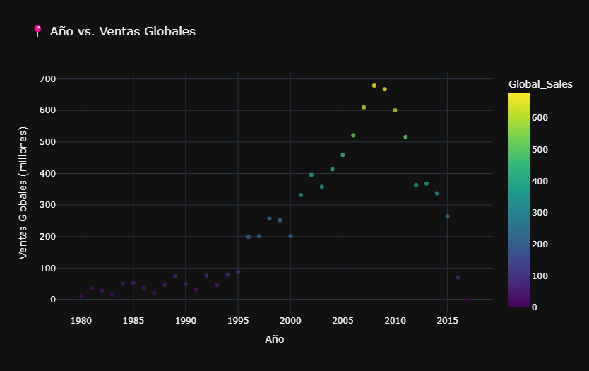
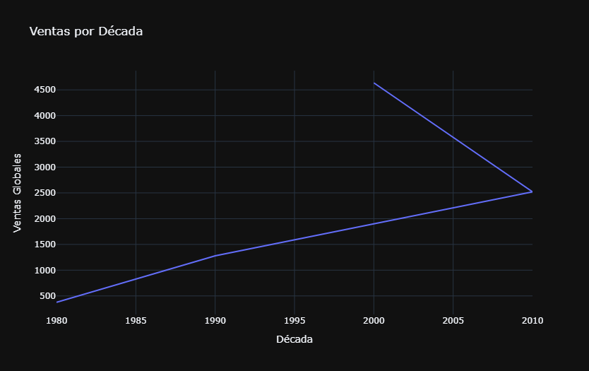
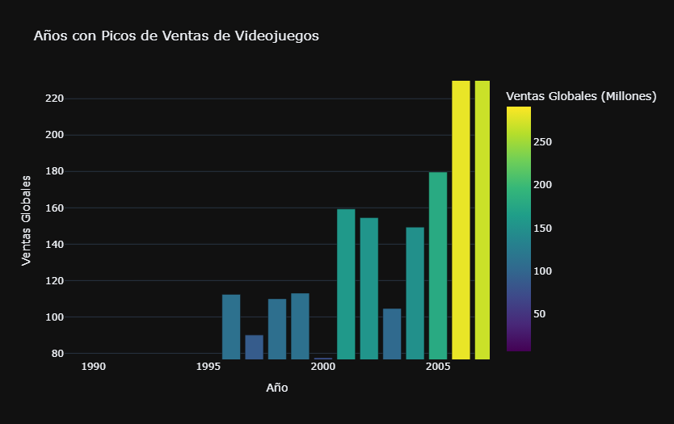

# 📊 GameMarket Insights .

## Introducción

El siguiente proyecto tiene como objetivo extraer **insights clave** sobre el mercado de videojuegos a escala global, analizando su evolución a lo largo de los años. Para ello, he utilizado **Python** en la etapa de análisis exploratorio de los datos y **Power BI** para la visualización y elaboración del informe.

A lo largo del análisis, se identifican patrones en las ventas según distintos factores, lo que permite comprender mejor las dinámicas de la industria y su impacto en el mercado. A continuación, describiré los métodos utilizados y compartiré las principales observaciones obtenidas a partir del dataset.

---

## 🎯 Enfoque del Análisis

### Pregunta Principal
**¿Cómo se comportan las ventas de videojuegos en función del tiempo, la plataforma, el género, la editorial y la región?**

Para responder esta cuestión, abordaremos las siguientes preguntas clave:

---

### 📌 1. Ventas en función del tiempo
**Objetivo:** Identificar tendencias y cambios en el mercado.

- 🔹 **¿Cuáles fueron los años con más ventas globales?**
- 🔹 **¿Hubo alguna tendencia de crecimiento o caída en ciertas décadas?**
- 🔹 **¿Existen años "pico" en los que salieron muchos juegos exitosos?**

### 📌 2. Impacto de plataformas y géneros  
**Objetivo:** Analizar la evolución de las consolas más exitosas y la popularidad de los distintos géneros de videojuegos en el tiempo y por región.  
 
- 🔹 **¿Cuáles fueron las plataformas más vendidas y cómo evolucionaron?**  
- 🔹 **¿Qué géneros dominaron el mercado y cómo varían por región?**  

### 📌 3. Editoriales líderes y análisis por región  
**Objetivo:** Identificar qué empresas han dominado el mercado y cómo varían las preferencias según cada región.  
 
- 🔹 **¿Cuáles son las editoriales con más ventas globales?**  
- 🔹 **¿Qué empresa tuvo más juegos exitosos en cada década?**  
- 🔹 **¿Cómo varía el éxito de los géneros según la región?**  

## 📊 Metodología

Para este análisis, utilicé un **dataset** con información sobre ventas de videojuegos a nivel global. Antes de comenzar, realicé una **limpieza de datos** con Python, verificando valores nulos y asegurándome de que las columnas fueran consistentes. Luego, importé los datos a **Power BI** para crear visualizaciones interactivas y explorar tendencias clave.

---
### 📌 1. Ventas en función del tiempo
**Objetivo:** Identificar tendencias y cambios en el mercado.

El análisis de las ventas globales de videojuegos a lo largo del tiempo nos revela algunos patrones clave en la evolución de la industria. Durante el período de 2004 a 2013, las ventas fueron especialmente altas, alcanzando su punto máximo en 2008 con 678.9 millones de unidades, seguido de cerca por 2009 (667.3 M) y 2007 (609.92 M). Este pico posiblemente corresponde a un auge de consolas populares como la PS2, Xbox 360 y Nintendo DS, que junto con el crecimiento de franquicias icónicas como Call of Duty, Grand Theft Auto, Halo, y The Elder Scrolls, marcaron una era dorada para la industria.

📊  Años con más ventas globales
|     Year     | Global Sales (M) |
|:-----------:|:---------------:|
|    **2008**   |    **678.9**    |
|    **2009**   |    **667.3**    |
|    **2007**   |    **609.92**   |
|    **2010**   |    **600.29**   |
|    **2006**   |    **521.04**   |
|    **2011**   |    **515.8**    |
|    **2005**   |    **458.51**   |
|    **2004**   |    **414.01**   |
|    **2013**   |    **368.11**   |

📉 Tendencia de ventas a lo largo del tiempo

Las ventas globales crecieron de forma constante desde los años 80 hasta los 2000, alcanzando su máximo en la década de 2000 (4,636M de unidades vendidas), especialmente entre los años 2004 y 2013, con el máximo en 2008. Esta tendencia se asocia con el impacto de las mencionadas consolas y franquicias.

Sin embargo, después de 2013, se observa una caída gradual en las ventas, lo que podría estar relacionado con varios factores, como el cambio en los hábitos de consumo y la transición hacia nuevas plataformas digitales y modelos de negocio, como los juegos en línea, los servicios de suscripción y los free-to-play.

### 📌 2. Impacto de plataformas y géneros  

### 🔹 Plataformas más vendidas  
La consola con mayores ventas fue **PS2**, alcanzando un pico de **211.78 millones de unidades en 2004**. Su éxito puede atribuirse a:  
- Su extenso catálogo de juegos.  
- Compatibilidad con títulos de PS1.  
- Su impacto en la evolución de la industria del entretenimiento digital.  

Tras este auge, se observa una estabilización y posterior declive en sus ventas, coincidiendo con la llegada de consolas de nueva generación como la **Xbox 360** y la **PS3**.  

### 🔹 Preferencias de géneros según región  
🎮 **Norteamérica:** El género más vendido fue **Action**.  
🎮 **Europa:** El género dominante también fue **Action**.  
🎮 **Japón:** Predominó el género **Role-Playing (RPG)**, reflejando su fuerte tradición en títulos narrativos como **Final Fantasy** y **Dragon Quest**.  
🌍 **Global:** El género más vendido fue **Action**, consolidando su liderazgo en la industria.  

Los datos muestran que la popularidad de las consolas y los géneros de videojuegos varía según la región y la evolución de la industria.  
- **PS2 dominó una era**, pero su declive dio paso a nuevas generaciones de consolas.  
- **Las preferencias de género varían**: Mientras que los juegos de acción lideran en Occidente, los RPGs tienen mayor impacto en Japón.  

Estos factores han moldeado la evolución del mercado y seguirán influyendo en las tendencias futuras.

¡Gracias por leer! Si te interesa conocer más sobre los detalles del proyecto, consulta los archivos adicionales o contáctame para más información.

