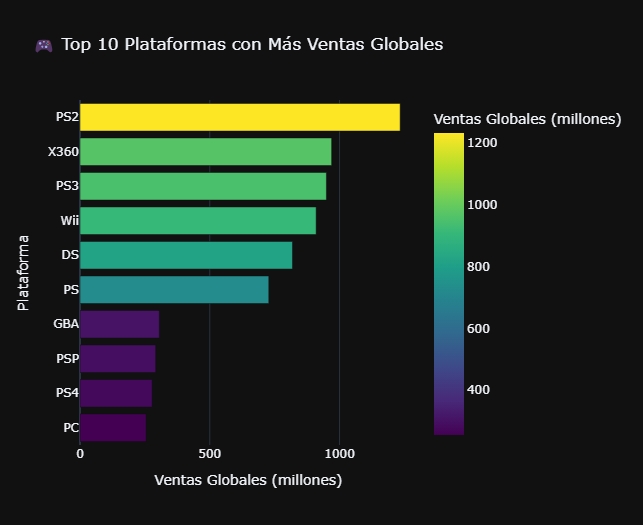
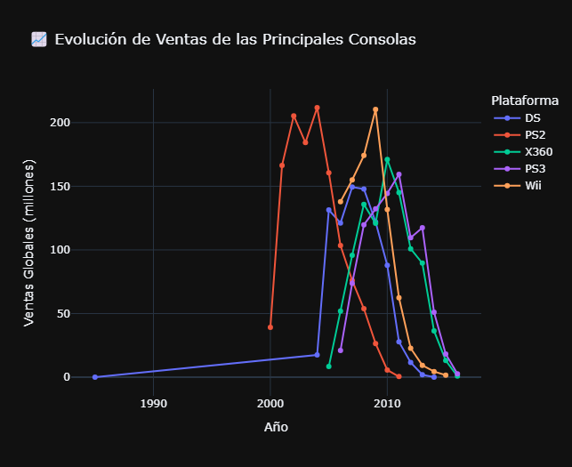
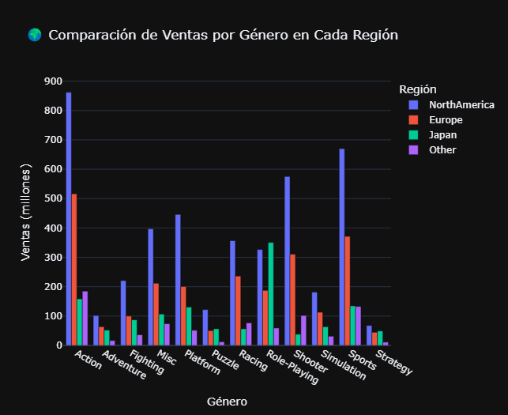
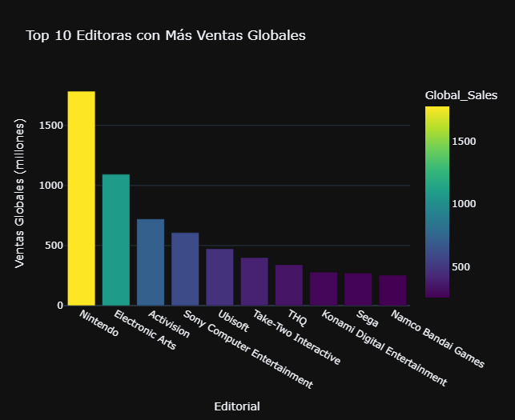
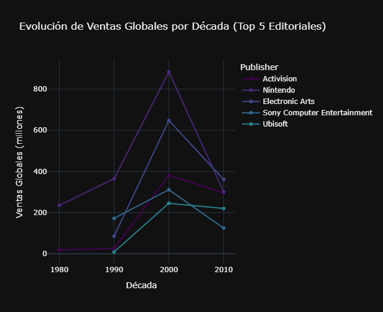
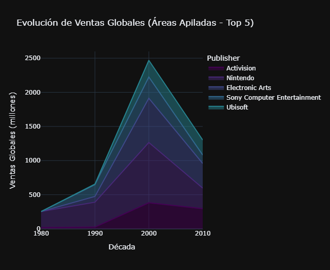

# 📊 GameMarket Insights .

## Introducción

El siguiente proyecto tiene como objetivo extraer **insights clave** sobre el mercado de videojuegos a escala global, analizando su evolución a lo largo de los años. Para ello, he utilizado **Python** en la etapa de análisis exploratorio de los datos y **Power BI** para la visualización y elaboración del informe.

A lo largo del análisis, se identifican patrones en las ventas según distintos factores, lo que permite comprender mejor las dinámicas de la industria y su impacto en el mercado. A continuación, describiré los métodos utilizados y compartiré las principales observaciones obtenidas a partir del dataset.

---

## 🎯 Enfoque del Análisis

### Pregunta Principal
**¿Cómo se comportan las ventas de videojuegos en función del tiempo, la plataforma, el género, la editorial y la región?**

Para responder esta cuestión, abordaremos las siguientes preguntas clave:

---

### 📌 1. Ventas en función del tiempo
**Objetivo:** Identificar tendencias y cambios en el mercado.

- 🔹 **¿Cuáles fueron los años con más ventas globales?**
- 🔹 **¿Hubo alguna tendencia de crecimiento o caída en ciertas décadas?**
- 🔹 **¿Existen años "pico" en los que salieron muchos juegos exitosos?**

### 📌 2. Impacto de plataformas y géneros  
**Objetivo:** Analizar la evolución de las consolas más exitosas y la popularidad de los distintos géneros de videojuegos en el tiempo y por región.  
 
- 🔹 **¿Cuáles fueron las plataformas más vendidas y cómo evolucionaron?**  
- 🔹 **¿Qué géneros dominaron el mercado y cómo varían por región?**  

### 📌 3. Editoriales líderes y análisis por región  
**Objetivo:** Identificar qué empresas han dominado el mercado y cómo varían las preferencias según cada región.  
 
- 🔹 **¿Cuáles son las editoriales con más ventas globales?**  
- 🔹 **¿Qué empresa tuvo más juegos exitosos en cada década?**  

## 📊 Metodología

Para este análisis, utilicé un **dataset** con información sobre ventas de videojuegos a nivel global. Antes de comenzar, realicé una **limpieza de datos** con Python, verificando valores nulos y asegurándome de que las columnas fueran consistentes. Luego, importé los datos a **Power BI** para crear visualizaciones interactivas y explorar tendencias clave.

---
### 📌 1. Ventas en función del tiempo
**Objetivo:** Identificar tendencias y cambios en el mercado.

El análisis de las ventas globales de videojuegos a lo largo del tiempo nos revela algunos patrones clave en la evolución de la industria. Durante el período de 2004 a 2013, las ventas fueron especialmente altas, alcanzando su punto máximo en 2008 con 678.9 millones de unidades, seguido de cerca por 2009 (667.3 M) y 2007 (609.92 M). Este pico posiblemente corresponde a un auge de consolas populares como la PS2, Xbox 360 y Nintendo DS, que junto con el crecimiento de franquicias icónicas como Call of Duty, Grand Theft Auto, Halo, y The Elder Scrolls, marcaron una era dorada para la industria.

📊  Años con más ventas globales
|     Year     | Global Sales (M) |
|:-----------:|:---------------:|
|    **2008**   |    **678.9**    |
|    **2009**   |    **667.3**    |
|    **2007**   |    **609.92**   |
|    **2010**   |    **600.29**   |
|    **2006**   |    **521.04**   |
|    **2011**   |    **515.8**    |
|    **2005**   |    **458.51**   |
|    **2004**   |    **414.01**   |
|    **2013**   |    **368.11**   |

### 📉 Tendencia de ventas a lo largo del tiempo

Las ventas globales crecieron de forma constante desde los años 80 hasta los 2000, alcanzando su máximo en la década de 2000 (4,636M de unidades vendidas), especialmente entre los años 2004 y 2013, con el máximo en 2008. Esta tendencia se asocia con el impacto de las mencionadas consolas y franquicias.

Sin embargo, después de 2013, se observa una caída gradual en las ventas, lo que podría estar relacionado con varios factores, como el cambio en los hábitos de consumo y la transición hacia nuevas plataformas digitales y modelos de negocio, como los juegos en línea, los servicios de suscripción y los free-to-play.

---

### 📌 2. Impacto de plataformas y géneros  

### 🔹 Plataformas más vendidas  
La consola con mayores ventas fue **PS2**, alcanzando un pico de **211.78 millones de unidades en 2004**. Su éxito puede atribuirse a:  
- Su extenso catálogo de juegos.  
- Compatibilidad con títulos de PS1.  
- Su impacto en la evolución de la industria del entretenimiento digital.
- 
Tras este auge, se observa una estabilización y posterior declive en sus ventas, coincidiendo con la llegada de consolas de nueva generación como la **Xbox 360** y la **PS3**.  

El siguinte gráfico muestra las plataformas con más ventas a nivel Global.A medida que revisamos estas cifras, es crucial considerar no solo el volumen de ventas, sino también los factores que han contribuido a su éxito, como innovaciones tecnológicas, estrategias de marketing y cambios en las preferencias del consumidor.

El mercado de videojuegos experimentó una evolución particular en sus primeras décadas, destacándose DS como la plataforma dominante. La llegada de PS2 en la década de 2000 marcó un cambio significativo en este sector, seguido por el surgimiento de otras plataformas. Como se ilustra en el gráfico a continuación, desde la década de 2010 (o ligeramente antes), se observa una pronunciada disminución en las ventas, atribuida a cambios en las preferencias de los consumidores y la incorporación de nuevas tecnologías, como los juegos en línea y móviles.

### 🔹 Preferencias de géneros según región  
Las preferencias de género en los videojuegos varían significativamente según la región, influenciadas por factores culturales, históricos y tecnológicos. Mientras que ciertos géneros han logrado un éxito global, otros han encontrado mayor acogida en mercados específicos. A continuación, exploramos cómo estas diferencias han moldeado la industria y qué tendencias se destacan en cada región.

🎮 **Norteamérica:** El género más vendido fue **Action**.  
🎮 **Europa:** El género dominante también fue **Action**.  
🎮 **Japón:** Predominó el género **Role-Playing (RPG)**, reflejando su fuerte tradición en títulos narrativos como **Final Fantasy** y **Dragon Quest**.  
🌍 **Global:** El género más vendido fue **Action**, consolidando su liderazgo en la industria.  

Con base en el analisis, los datos nos muestran que la popularidad de las consolas y los géneros de videojuegos varía según la región y la evolución de la industria
.  
- **PS2 dominó una era**, pero su declive dio paso a nuevas generaciones de consolas.  
- **Las preferencias de género varían**: Mientras que los juegos de acción lideran en Occidente, los RPGs tienen mayor impacto en Japón.  

Estos factores han moldeado la evolución del mercado y el comportamiento del mismo y  seguirán influyendo en las tendencias futuras.

---

### 📌 3. Editoriales líderes y análisis por región  

## 🏆 Top Editoriales con Más Ventas Globales

| 🏅 **Posición** | 🏢 **Editorial** | 💰 **Ventas Globales (millones)** |
|--------------|----------------------------|----------------------|
| 🥇 1° | **Nintendo** | **1784.43M** |
| 🥈 2° | **Electronic Arts** | **1093.39M** |
| 🥉 3° | **Activision** | **721.41M** |
| 🎖️ 4° | **Sony Computer Entertainment** | **607.28M** |
| 🎖️ 5° | **Ubisoft** | **473.25M** |

📌 **Nintendo** se mantiene como líder absoluto, con un historial de éxitos que incluye **Super Mario, Pokémon y The Legend of Zelda**.  
📌 **Electronic Arts** domina en juegos deportivos con **FIFA y Madden**.  
📌 **Activision** ha consolidado su éxito con la franquicia **Call of Duty**.  
📌 **Sony Computer Entertainment** ha crecido con títulos exclusivos de PlayStation.  
📌 **Ubisoft** ha dejado su huella con **Assassin’s Creed y Just Dance**.  

## 📅 Editoriales con Más Juegos Exitosos por Década

### 🔹 Años 1980
- 🎮 **Nintendo** lidera con **234.92M** en ventas.
- 🎮 **Activision** sigue con **18.41M**, destacando con juegos clásicos de Atari.

### 🔹 Años 1990
- 🎮 **Nintendo** mantiene su reinado con **364.56M**.
- 🎮 **Electronic Arts** empieza a crecer con **84.98M**, gracias a su éxito en juegos deportivos.
- 🎮 **Activision** sigue relevante con **25.9M**.

### 🔹 Años 2000
- 🎮 **Nintendo** sigue a la cabeza con éxitos como Wii y DS.
- 🎮 **Electronic Arts** se mantiene fuerte con FIFA y otros títulos deportivos.
- 🎮 **Activision** domina con Call of Duty.

### 🔹 Años 2010
- 🎮 **Nintendo** sigue fuerte con Switch y sus franquicias icónicas.
- 🎮 **Sony Computer Entertainment** se posiciona con PlayStation exclusives.
- 🎮 **Electronic Arts** mantiene su éxito con juegos deportivos y franquicias como Battlefield.

A medida que avanzan las décadas, podemos ver cómo **Nintendo ha logrado mantenerse en la cima**, mientras que **EA, Activision y Sony** han crecido significativamente en el mercado de juegos modernos.

✅ **Nintendo** ha sido la empresa con más ventas globales y ha dominado todas las décadas analizadas.  
✅ **Electronic Arts y Activision** han crecido en los años 90 y 2000, destacando en juegos deportivos y shooters.  
✅ **Sony y Ubisoft** han logrado mantenerse entre los líderes con franquicias exclusivas y de mundo abierto.

## 🔥 Conclusión Final

El mercado de los videojuegos ha experimentado cambios significativos en las últimas décadas, impulsados por la evolución tecnológica y las preferencias de los jugadores. Este análisis nos permitió identificar tendencias clave en ventas, plataformas y géneros.

📈 Crecimiento y declive de las ventas
Las ventas alcanzaron su punto más alto entre 2004 y 2013, con un pico en 2008. Sin embargo, a partir de 2013, comenzaron a disminuir progresivamente debido a la transición hacia modelos de negocio digitales, como los juegos en línea, los servicios de suscripción y las plataformas móviles.

🎮 Impacto de las plataformas
La PlayStation 2 fue la consola más vendida a nivel global, mientras que otras como la Nintendo DS y la Xbox 360 dominaron en distintos períodos. No obstante, la industria ha evolucionado, dando paso a nuevas generaciones de consolas y tecnologías emergentes que han redefinido las preferencias de los jugadores.

🌎 Preferencias de género por región
Si bien los juegos de acción lideran las ventas globales y en Occidente, en Japón los RPG han sido los más populares, reflejando diferencias culturales en el consumo de videojuegos.

🏆 Editoriales líderes
Nintendo ha sido el actor más dominante en la industria, encabezando las ventas en todas las décadas analizadas. Electronic Arts y Activision han crecido con franquicias deportivas y shooters, mientras que Sony y Ubisoft han mantenido su relevancia con títulos exclusivos y de mundo abierto.

🎮🚀 Mirando hacia el futuro
El gaming no deja de evolucionar: nuevos modelos de negocio, innovaciones tecnológicas y cambios en las preferencias del público seguirán dando forma a la industria. ¿Cuál será la próxima gran revolución? Solo el tiempo lo dirá, pero lo que es seguro es que el mundo de los videojuegos no deja de sorprendernos.

📂 Explora más
¡Gracias por leer! Si quieres conocer más detalles sobre el proyecto, consulta los archivos adicionales o contáctame para más información.

